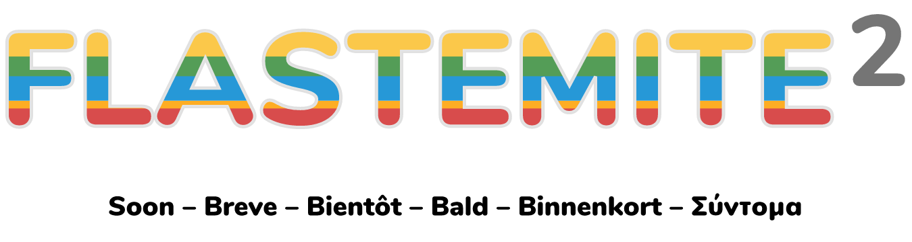
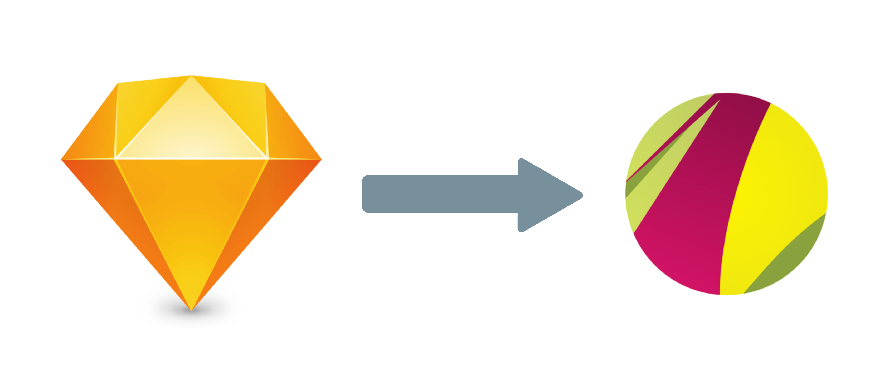

 

<h3 align="center">An elegant and new flat and squared material design icons pack for Linux, macOS and Windows!</h3>

#### Why the second version?
Because the second version will inherit the first version of icons pack I developed and hosted on Deviantart, but many of icons are outdated and it will follow Google and Materialize colours plaettes, to make them more elegant, excited and modern, for the flat macOS and other OSes. 

I'll build a icon pack theme into a Debian package for Linux distributions. 

#### Is there a difference between versions 1 and 2?

Yes, for example, at the right, the icons used to be 900px and didn't follow the material design and at the right, they are reduced 850px and follow material deisgn colours. The new icons derived of the apps‘ new icons:

#### What the new features of the second verison?
* I replaced Sketch for Gravit Designer, an open source vector editor app.

* Gravit Designer format
* ICNS format for macOS
* ICO format for Windows
* SVG format for Linux
* PNG, 1x and 2x for Android and iOS
* Localised icons
* Varietes of Finder characters

* Varietes of colours

* Varieties of icons
* Egg easters
* Flastemite icons font

The second version is still in development. It will come soon!
